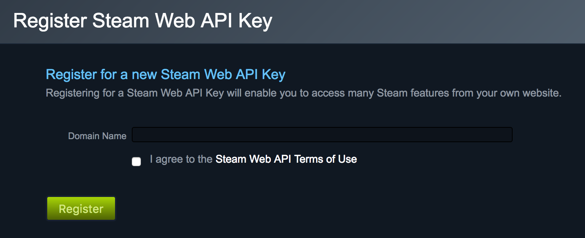

# feathers-authentication-openid Example

This provides a complete working example on how to use `feathers-authentication-openid` to provide Steam authentication and get a JWT access token in return.

1. Create an api key on Steam
    
    
    
    

2. Add your `apiKey` and `realm` to the app.
3. Start the app by running `npm start`
4. Go to [http://localhost:3030/auth/steam](http://localhost:3030/auth/steam) in your browser
